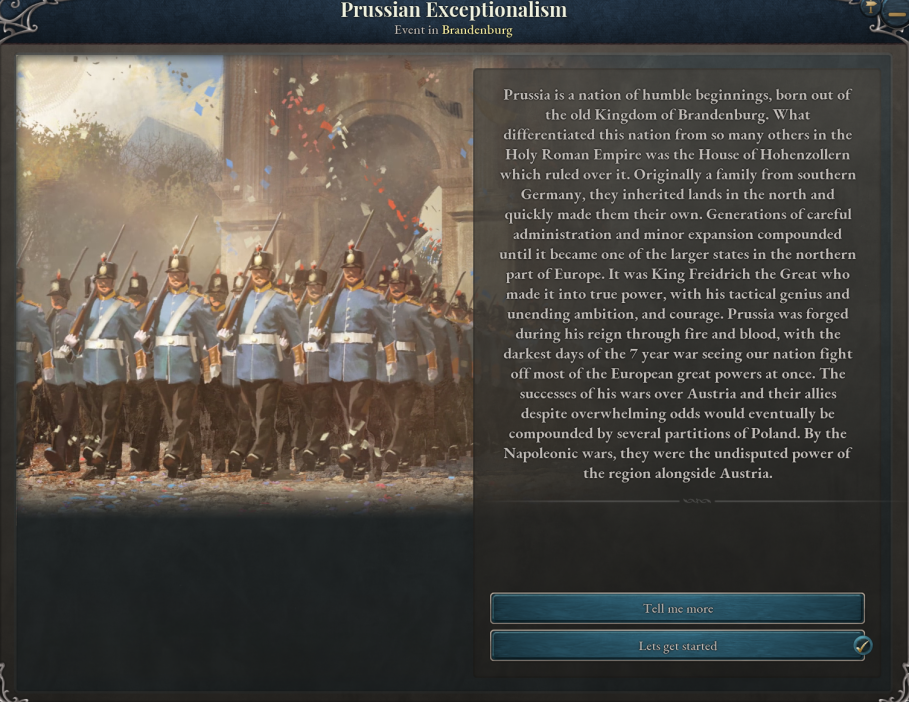

# Imperia Roleplay

Imperia Roleplay is a mod for Victoria 3 aimed at multiplayer playthroughs by compiling multiple mods, adding unique flavor, and balancing mechanics with the goal of enhancing historically plausible story-driven gameplay. It is the main mod for the Victoria 3 community of Imperia Roleplay.

Main features of the mod:
-	**Roleplay primers** which give a summary of a nation’s history at game start.

-	**Expanding** and **balancing** laws, with some of our own unique laws and balancing laws so there are no “meta” laws. For example, public schooling is nerfed and more options such as “Patriotic Schools” are added.

-	**Balance gameplay around history**, such as making authoritarian and conservative playthroughs viable rather than pushing for modernization and liberalization as the only viable gameplan.
-	**Nation specific flavor** through state traits and unique journal entries/event chains such as a reworked Tanzimat journal entry for the Ottoman Empire and a similar journal entry for the Qing empire which can contribute to its collapse into warlord states or the centralization of the empire.
-	**New nations** aimed at encouraging intriguing diplomatic play in a multiplayer setting such as Poland and multiple Qing governorates.

## New this patch ##
- **Revamped Tanzimat:** The Ottoman Sphere is getting more events and decisions to improve the roleplaying of all players involved in the area.
- **Carlist Wars:** Pick your side on the war for the right to rule the monarchy.
- **Revamped Qing:** Updates on all JEs and Events involving the Qing and their governors and tributaries, including their own Power Bloc, the Mandate of Heaven.
- **Frankfurt Conference:** Sway Princes and decide the fate of the new united Germany under the Gutter King.
- **Balance Patch Update for New & Old Mechanics** 
- **New Icons for our Technologies & Mobilization Options**

As a multiplayer centric mod, we also add many unique mechanics aimed for RP multiplayer games and QoL changes such as:
-	**Great Power congress**: Great powers can call a Congress based on the Congress of Vienna, in which a GP can request claim to a state, denounce or embargo a fellow power, or recognize a foreign power. Events about the Congress will fire for as long as the Congress is active, simulating interactions between the attendees’ diplomatic teams. Great Powers and Major Powers can vote in the Congress once their mind is made up by supporting, opposing, or abstaining the motion, impacting the vote by the amount of prestige they have.

-	**Political Discord**: Political Discord is a measure of how disjoint your external and internal politics are. Actions such as allying an ideologically opposing nation will make this number go up, and making decisions in events that go against the politics of your nation will also increase this number. Once the cap of 400 is reached, your nation will implode into many states, representing the many political disagreements within your country causing a civil war and a collapse of centralized government.

-   **Transfer Money Tool**: A new tab on the budget interface enabling direct money transfer between nations to aid players in negotiations and emergency aid packages. 
-	**QoL for Multiplayer**: Many other mechanics are balanced around multiplayer games, such as a split bonus to construction depending on your nation rank (10/5/0 for Minor Powers/Major Powers/Great Powers) and disabling the pause button/speed buttons so they are only available to the host.

To improve multiplayer stability, we have compiled and adapted multiple mods that range from QoL improvements to flavor mods, such as:
-	[Compact States](https://steamcommunity.com/sharedfiles/filedetails/?id=2882253806): Compact state overview which allows player to see all state’s stats in a single window.
-	[Guaranteed Independence](https://steamcommunity.com/sharedfiles/filedetails/?id=2895380761&searchtext=guarantee): Adds a diplomatic action to guarantee or request another nation to guarantee independence, allowing a nation to always aid without using alliances or subjugation.
-	[Miniature World](https://steamcommunity.com/sharedfiles/filedetails/?id=2885753695&searchtext=miniature+world): Modifies models to be as true to size as possible, making cities look more realistic in the map.
-	[Clear miniature roads](https://steamcommunity.com/sharedfiles/filedetails/?id=2887217219&searchtext=roads): Prevents buildings from spawning on top of roads and rails, adding map immersion.
-	[Dense trade route tab](https://steamcommunity.com/sharedfiles/filedetails/?id=2881996099&searchtext=trade+route): Changes the trade routes tab into a more compact version.
-	[Enhanced Graphics](https://steamcommunity.com/sharedfiles/filedetails/?id=3041433916&searchtext=enhaned+graphics): Enhanced lighting and graphics mod that makes several changes to make the game look better.
-	[East Asian Namelist Improvement](https://steamcommunity.com/sharedfiles/filedetails/?id=3032148089&searchtext=east+asian+): Fixes many of the East Asian cultures to have historically accurate names.

Mods that were used previously, and have inspired our own version of things:
-	[Victoria Tweaks](https://steamcommunity.com/sharedfiles/filedetails/?id=2935989855&searchtext=tweaks): Lightweight mod whose aim is to enhance gameplay experience such as tweaking population growth, small improvement to flavor, among many others.
-	[Better Decrees](https://steamcommunity.com/sharedfiles/filedetails/?id=2895956555&searchtext=better+decrees): Adds and renames multiple decrees. We have balanced the cost and multipliers of these based player feedback.

CREDITS
This mod is a passion project developed by:
Lead Developers:
-	hidde0 
-	fallonar 
-	danarca

Modders:
-	arkaik.0 | emifas | animeminecraftsheep | .sir_cheese | crushita |  RevoLou

With contributions from:
-	dominikusrex

Former lead developers:
-	johnbrown1
-	hammurabae

Former modders:
-	banana9050 | supermax9839 | quasarkaese | aleksander108  |  Blackpantherdarwin  | catto6 | quaza_  

Links:
-	[Imperia RP Development Discord](https://discord.gg/zkTQnVd82e)
-	[Imperia RP Community](https://discord.gg/imperiarp)
